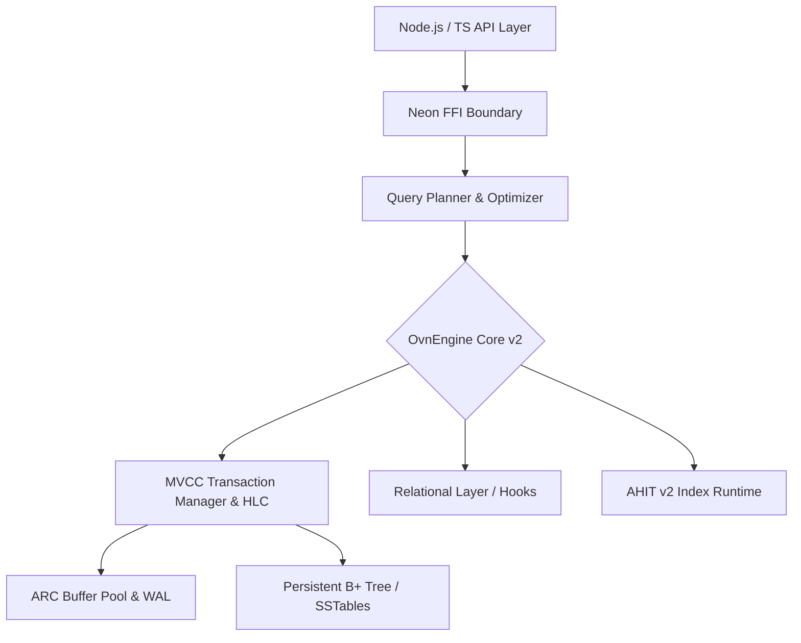

# 🌌 Oblivinx3x 

> **High-Performance Embedded Document Database** — Built in Rust, powered by Node.js. Single file, zero configuration, in-process, pure ACID.

[](https://npm.im/oblivinx3x)
[](https://github.com/natz/oblivinx3x/actions)
[](LICENSE)
[](#)

Oblivinx3x **v2.0 (Nova)** bridges the gap between massive scale-out databases and simple embedded key-value stores. It gives you the full power of the MongoDB Query Language (MQL) with an advanced Hybrid B+/LSM storage architecture executing right inside your Node.js process. Featuring high-concurrency multi-writer MVCC, ARC buffer pooling, and Hybrid Logical Clocks.

---

## 📑 Table of Contents
1. [Why Oblivinx3x?](#1-why-oblivinx3x)
2. [Architecture Overview](#2-architecture-overview)
3. [Quick Start](#3-quick-start)
4. [Installation](#4-installation)
5. [TypeScript API Reference](#5-typescript-api-reference)
6. [Query Builder Guide](#6-query-builder-guide)
7. [SQL-Like Query Guide](#7-sql-like-query-guide)
8. [Versioned Documents Guide](#8-versioned-documents-guide)
9. [CLI Tool Reference](#9-cli-tool-reference)
10. [Backup & Recovery Guide](#10-backup--recovery-guide)
11. [Security Guide](#11-security-guide)
12. [Performance Tuning Guide](#12-performance-tuning-guide)
13. [Indexing Deep Dive](#13-indexing-deep-dive)
14. [Aggregation Pipeline Reference](#14-aggregation-pipeline-reference)
15. [MQL Operator Reference](#15-mql-operator-reference)
16. [Transactions & Savepoints Guide](#16-transactions--savepoints-guide)
17. [Change Streams Guide](#17-change-streams-guide)
18. [Views & Materialized Views](#18-views--materialized-views)
19. [Triggers & Event Hooks](#19-triggers--event-hooks)
20. [Relational Layer](#20-relational-layer)
21. [Attached Databases](#21-attached-databases)
22. [Geospatial Guide](#22-geospatial-guide)
23. [Full-Text Search Guide](#23-full-text-search-guide)
24. [Vector Search Guide](#24-vector-search-guide)
25. [Migration Guide](#25-migration-guide)
26. [Contributing Guide](#26-contributing-guide)
27. [Changelog](#27-changelog)
28. [License & Credits](#28-license--credits)

---

## 1. Why Oblivinx3x?

| Feature | Oblivinx3x | MongoDB | SQLite | RocksDB |
|---------|------------|---------|--------|---------|
| **Deployment** | Embedded (In-process) | External Server | Embedded | Embedded |
| **Data Model** | Documents (JSON/OBE) | Documents (BSON) | Relational SQL | Key-Value |
| **Write Amp.** | Tunable (Hybrid Tree) | High (B-Tree + WAL) | High (B-Tree) | High (LSM Compaction) |
| **Query Lang.** | MQL + Flent + SQL-Like | MQL | SQL | API iterators |
| **File Format** | Single `.ovn` file | Multiple `.wt` files | Single `.sqlite` file | Multiple `.sst` files |
| **Transactions** | Full ACID (MVCC) | Full ACID | Full ACID | Mostly ACID |
| **JS/TS Support**| Native & Type-safe | Official Driver | Numerous libraries | `leveldb` wrappers |

---

## 2. Architecture Overview (Nova v2.0)

### System Layer Diagram



### The Adaptive Hybrid Index Tree (AHIT) v2
Oblivinx v2 automatically analyzes access patterns. It uses an **Adaptive Radix Tree (ART)** for sub-microsecond point lookups in the Hot Zone (Tier-0), and dynamically constructs **PGM++ Learned Indexes** (Tier-1) to predict key locations on disk with `O(1)` space complexity, falling back to B-Trees only when necessary.

### Concurrency and Data Layout
The `.OVN2` single-file layout safely partitions Data, Indexes, Logs (WAL), and Metadata directly into page-aligned Segments protected by **CRC32C**. With **Multi-Writer MVCC** powered by 64-bit **Hybrid Logical Clocks (HLC)**, transactions are causally ordered globally. Readers never block writers, and writers don't block each other!

### ARC Buffer Pool & WAL Group Commit
Cache eviction in v2 is handled by an **Adaptive Replacement Cache (ARC)**, dramatically outperforming standard LRU on mixed workloads (scans + random access). Durability is configurable down to the transaction level via **WAL Group Commit** architectures (`d0`, `d1`, `d1strict`, `d2`).

---

## 3. Quick Start

Create a robust database and run your first query in under 60 seconds.

```typescript
import { Oblivinx3x } from 'oblivinx3x';

// Initialize DB v2 (creates file if not exists)
const db = new Oblivinx3x('mydb.ovn2', { 
  durability: 'd1',          // WAL Group Commit enabled
  concurrentWrites: false,   // Single writer safety by default
  compression: 'lz4',
  bufferPool: '256MB'
});

const users = db.collection<{ name: string, age: number }>('users');

await users.insertOne({ name: 'Alice', age: 28 });
const result = await users.find({ age: { $gte: 20 } });
console.log(result); // [{ name: 'Alice', age: 28, ... }]

await db.close();
```

---

## 4. Installation

Supported across Windows, Linux, and macOS (x64 and ARM64).

```bash
npm install oblivinx3x
# To use the CLI globally:
npm install -g oblivinx3x
```
*Pre-compiled binaries are shipped directly. No Rust toolchain installation is required!*

---

## 5. TypeScript API Reference

Oblivinx3x offers a beautifully typed Object-Oriented interface.

### `Database` Context
```typescript
import { Oblivinx3x } from 'oblivinx3x';

const db = new Oblivinx3x('test.ovn2', { 
    bufferPool: '512MB',
    durability: 'd1strict',
    concurrentWrites: true, // Enables high-concurrency Multi-Writer mode
    hlc: true               // Hybrid Logical Clock for distributed ordering
});

// Operations
await db.createCollection('users', { validationLevel: 'strict' });
const coll = db.collection<User>('users');

// Auto-retrying transaction block
await db.withTransaction(async (txn) => {
  await txn.update('users', { _id: '1' }, { $set: { active: true } });
});

// Advanced metrics
const info = await db.getEngineInfo();
console.log(`ARC Hit Rate: ${info.arcCache?.hitRate ?? 0}`);
```

### `Collection<T>`
```typescript
await coll.insertOne(doc);
await coll.insertMany(docs);
await coll.find(filter, options);
await coll.findOne(filter);
await coll.updateOne(filter, update);
await coll.deleteOne(filter);
await coll.aggregate(pipeline);
await coll.query(); // Returns Fluent QueryBuilder
await coll.sql`SELECT * FROM users`; // Returns SqlLikeQuery
```

### Error Classes
Explicit Error Hierarchy exported under `oblivinx3x/errors`:
*   `OblivinxError` (Base)
*   `StorageError`, `CorruptionError`
*   `TransactionError`, `WriteConflictError`
*   `QueryError`, `SyntaxError`
*   `SecurityError`, `VersionConflictError`

---

## 6. Query Builder Guide

A fully Chainable, Immutable Fluent API for constructing strict MQL outputs. 

```typescript
const activeAdmins = await db.collection<User>('users')
  .query()
  .where('age', '$gte', 18)
  .whereIn('tags', ['admin', 'moderator'])
  .whereExists('email')
  .sort('createdAt', 'desc')
  .limit(10)
  .execute();
```

All standard query techniques are chained into `execute()`, `first()`, `count()`, or async generators (`stream()`).

---

## 7. SQL-Like Query Guide

Easily translate standard declarative SQL queries directly down to the AST and Aggregation compiler!

```typescript
// Support for SELECT, WHERE, ORDER BY, LIMIT, SKIP, and complex JOIN operations
const users = await db.collection<User>('users')
  .sql`SELECT name, age, email 
       FROM users 
       WHERE age > ${18} AND address.city = ${'Jakarta'}
       ORDER BY age DESC
       LIMIT ${10}`;
```

---

## 8. Versioned Documents Guide

Oblivinx3x is engineered to natively store sequential or snapshot diffs of documents through `VersionedDocument`.

```typescript
await db.createCollection('documents', {
  versioning: {
    enabled: true,
    mode: 'diff', // Only store modifications
    maxVersions: 50 // retain the last 50 edits
  }
});

// Perform operations ... then analyze version diffs!
const history = await db.collection('documents').listVersions(docId);
const diff = await db.collection('documents').diffVersions(docId, 1, 2);

// Time Travel: Complete Rollback
await db.collection('documents').rollbackToVersion(docId, 1);
```

---

## 9. CLI Tool Reference

The `ovn` command provides robust pipeline utilities and REPL interface to any `.ovn` file.

```bash
# REPL Shell
ovn open mydb.ovn

# Standalone Utility
ovn info mydb.ovn
ovn find mydb.ovn users '{"age": {"$gt": 18}}' --format table
ovn check mydb.ovn # Integrity Check
ovn backup create mydb.ovn --output backup.ovnbak --compress
ovn import mydb.ovn users --file dataset.json
```

---

## 10. Backup & Recovery Guide

Create highly efficient Incremental or Full Backups while the database remains perfectly active in-flight!

```typescript
const backupManager = db.backupManager();

// Create Compressed & Encrypted Backups
await backupManager.createFull({
  outputPath: './backups/full.ovnbak',
  compress: true,
  encrypt: { password: 'my-secret', algorithm: 'aes-256-gcm' }
});

// Restore operations
await backupManager.restore('./backups/full.ovnbak', './restored.ovn', { ... });
```

---

## 11. Security Guide

*   **Encryption at Rest:** Optional AES-256-GCM encryption per collection.
*   **Page Integrity:** CRC32 checksum at the end of every 4KB Storage Page ensures guaranteed fault detection on disk decay. 
*   **Audit Logging:** Easily enable full JSON-line audits across operations with parameter redacting.
*   **DOS Protection:** Soft and Hard Query Timeouts configurable per instance.

---

## 12. Performance Tuning Guide

The underlying Rust Runtime is meticulously tuned, but configuration pragmas can shift it strictly for Read or Write-dominated flows:
*   **WAL Configuration:** Configure `synchronous` (`off`, `normal`, `full`).
*   **Buffer Sizing:** Scale `bufferPool` directly to your Edge container memory limit (e.g. `128MB`).
*   **Compaction Controls:** Trigger manual `ovn compact <path.ovn>` for vacuuming space. 

---

## 13. Indexing Deep Dive

We utilize **AHIT** and **Skip-Column Optimization (SCO)**.
Types of indexes supported through `indexSpec`:
*   Standard & Compound (`createIndex({a: 1, b: -1})`)
*   Unique (`createIndex({...}, { unique: true })`)
*   Sparse & Partial
*   Hidden (Maintained in background, omitted from Planner).
*   TTL Indexes (Automatic GC for expired temporal columns).

---

## 14. Aggregation Pipeline Reference

Over 18 stages directly integrated with MQL semantics!
Stages configured: `$match`, `$group`, `$project`, `$sort`, `$limit`, `$skip`, `$unwind`, `$lookup`, `$count`, `$facet`, `$bucket`, `$addFields`, `$out`.

Accumulators Supported: `$sum`, `$avg`, `$min`, `$max`, `$first`, `$last`, `$push`, `$addToSet`.

---

## 15. MQL Operator Reference

The Filter Pipeline supports an expansive catalog of MongoDB semantics:
*   *Comparison*: `$eq`, `$gt`, `$gte`, `$in`, etc.
*   *Logical*: `$and`, `$or`, `$not`, `$nor`.
*   *Array*: `$all`, `$elemMatch`, `$size`.
*   *Element*: `$exists`, `$type`.

---

## 16. Transactions & Savepoints Guide

Every single operation guarantees Write isolation under an atomic MVCC epoch wrapper.
In v2, you can execute operations confidently using the `withTransaction` auto-retry block, which uses exponential backoff and jitter to resolve WriteConflicts smoothly during concurrent workloads.

```typescript
// Safely transfer funds between documents with auto-retry
await db.withTransaction(async (txn) => {
   const [alice] = await txn.find('users', { _id: 'alice' });
   const [bob]   = await txn.find('users', { _id: 'bob' });

   if ((alice.balance as number) < 100) throw new Error("Insufficient funds");

   await txn.update('users', { _id: 'alice' }, { $inc: { balance: -100 } });
   await txn.update('users', { _id: 'bob' },   { $inc: { balance: 100 } });
}, { maxRetries: 5 });
```

For advanced control, you can construct `savepoint()` checkpoints manually:

```typescript
const txn = await db.beginConcurrent(); // Allows multi-writer concurrency
await txn.insert('users', doc);
await txn.savepoint('sp1');
try {
   await txn.delete('users', filter);
   throw new Error("Oh no");
} catch(e) {
   await txn.rollbackToSavepoint('sp1'); // Only reverts deletion
}
await txn.commit();
```

---

## 17. Change Streams Guide

Subscribe to native mutation hooks internally streaming from the memory boundaries!

```typescript
const stream = db.collection('orders').watch([{ $match: { status: 'created' } }]);
stream.on('change', (event) => {
   console.log('New Order!', event.fullDocument);
});
```

---

## 18. Views & Materialized Views

Build structured read shortcuts for pipelines. Materialized Views flush data into permanent tables on specific refresh triggers:
```typescript
await db.createView('active_users', {
  source: 'users',
  pipeline: [{ $match: { active: true } }],
  materialized: true // Creates physical caches internally
});
```

---

## 19. Triggers & Event Hooks

Run strictly bound functions before inserts. 
```typescript
await db.createTrigger('users', 'beforeInsert', async (context) => {
   if(context.document.age < 18) throw new Error("Underage!");
   context.document.createdAt = new Date();
   return context.document;
});
```

---

## 20. Relational Layer

Add explicit referential cascading functionality reminiscent of strict relational topologies to your Documents!

```typescript
await db.defineRelation({
  from: 'posts.authorId',
  to: 'users._id',
  type: 'many-to-one',
  onDelete: 'cascade' // Will automatically truncate Posts when User is deleted
});
await db.setReferentialIntegrity('strict');
```

---

## 21. Attached Databases

Cross-Database functionality allows treating alternative `.ovn` files universally through standard queries internally.

```typescript
await db.attach('./archives.ovn', 'historical');
const oldDocs = await db.collection('historical.users').find({});
```

---

## 22. Geospatial Guide
Execute accurate distance geometry functions leveraging built-in optimizations!
*   `$geoWithin` (intersect polygons via GeoJSON wrappers).
*   `$near` calculations natively calculated via R-Trees and S2 Cell index scans.

---

## 23. Full-Text Search Guide
Build advanced dictionaries tracking stemmers across documents.
```typescript
await articles.createIndex({ content: 'text' });
await articles.find({ $text: { $search: 'high performance database engine' } });
```

---

## 24. Vector Search Guide
Native HNSW graphs exist inside Oblivinx3x to correlate dimensions mapped dynamically through vector embeddings, optimized heavily for Cosine Similarity calculations right out-of-the-box.

---

## 25. Migration Guide
Define strictly controlled Schema changes inside a bound `MigrationRunner` ensuring isolated and completely safe `up()` and `down()` environments across large deployments.

---

## 26. Contributing Guide

We welcome Contributions! Our build process natively handles cross environments:
1. Ensure Rust target toolchains are updated via `rustup`.
2. Compile Rust code to libraries inside `./crates/`.
3. Use `npm run build:neon` to bind binaries to the Node.js boundary.
4. Pass `npm run test` explicitly before mapping PRs.

---

## 27. Changelog 

*   **v0.0.5 (Nova)**: Massive architectural rewrite! Introduced `.OVN2` format, Multi-Writer MVCC with Hybrid Logical Clocks (HLC), ARC Buffer Pool caching, WAL Group Commit (`DurabilityLevel`), and AHIT v2 (ART + PGM++ Learned Indexes).
*   **v0.0.4**: Total Implementation of TypeScript OOP hierarchies, Fluent Query Builders, Versioned Documents, SQL-like abstractions, and Backup Mangers!
*   **v0.0.2**: Ahit Index Stabilizations, Relational Cascading Layer validations, and Materialized views.
*   **v0.0.1**: Initial Rust MVCC logic integrations.

---

## 28. License & Credits

Oblivinx3x is offered under the **MIT License**.
*Developed with intensity for Advanced Application Runtimes.*
